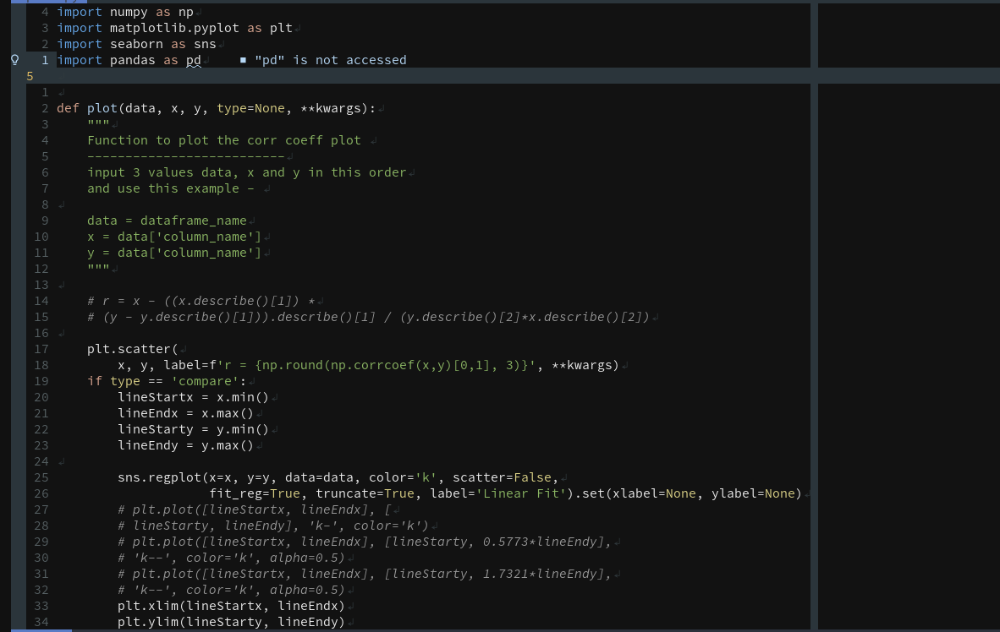
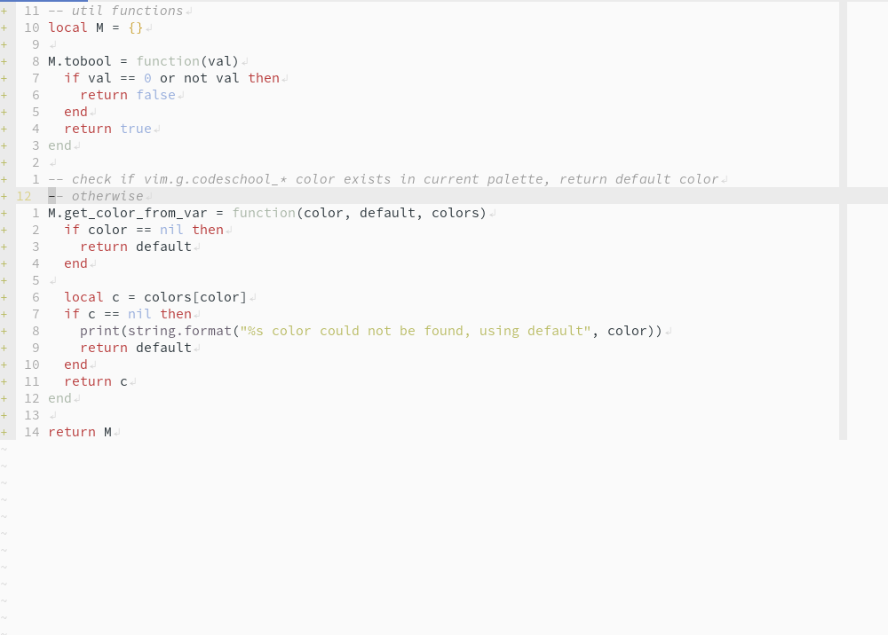

# codeschool.nvim

A pretty colorscheme for neovim written in `Lua` based on the [codeschool.vim](https://github.com/flazz/vim-colorschemes/blob/master/colors/codeschool.vim) color pattete.

The basic structure and most of the code is inspired from the [gruvbox.nvim](https://github.com/npxbr/gruvbox.nvim) colorscheme written by `npxbr` and [Ellison Leao](https://github.com/ellisonleao)

# Installation

**Requirements** - `codeschool.nvim` requires the `neovim-nightly` or `neovim v0.5` to work.

Using `vim-plug`

```vim
Plug 'rktjmp/lush.nvim'
Plug 'adisen99/codeschool.nvim'
```

Using `packer`

```lua
use {"adisen99/codeschool.nvim", requires = {"rktjmp/lush.nvim"}}
```

# Usage

Inside `init.vim`

```vim
set background=dark " or light if you want light mode
colorscheme codeschool
```

Inside `init.lua`
```lua
vim.o.background = "dark" -- or "light" for light mode
vim.cmd('colorscheme codeschool')
```

# Configuration

- Setting the Contrast (hard, medium or soft)

```vim
lua vim.g.codeschool_contrast_dark = "medium"
````

or

```vim
lua vim.g.codeschool_contrast_light = "soft"
```

Apart from this option, all `g:codeschool_` configs are the same [as the original gruvbox one](https://github.com/morhetz/codeschool/wiki/Configuration) except for `g:codeschool_guisp_fallback`. The exact options will be added in the Wiki of this project soon. In the meantime you can use the gruvbox ones by changing the prefix from `gruvbox_` to `codeschool_`

# Additional supported plugins

- [vim-signify](https://github.com/mhinz/vim-signify)
- [vim-startify](https://github.com/mhinz/vim-startify)
- [nvim-tree](https://github.com/kyazdani42/nvim-tree.lua)
- [lspsaga.nvim](https://github.com/glepnir/lspsaga.nvim)
- [telescope.nvim](https://github.com/nvim-telescope/telescope.nvim)

# Screenshots

## dark mode



## light mode



# Contribution

This colorscheme is still in development and testing. Users are welcome to use it however for programming daily. In case a user spots any bugs or error especially related to the supported plugins, treesitter or built-in LSP highlight support, then they can contribute by opening an issue or by making a pull request. More plugin highlight support is also welcome.

### TODO

- [x] Enable setup function
- [x] Enable support for choosing plugin highlights
- [x] Enable support for choosing language highlights
- [ ] Enable supprt for choosing options via setup function
- [x] Disable global set options functionality
- [x] Removed support for airline/lualine
- [x] Added theme in nvim-hardline

#### HAPPY CODING :smile:
